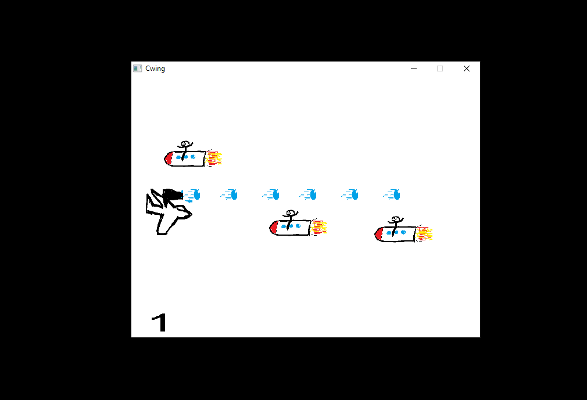
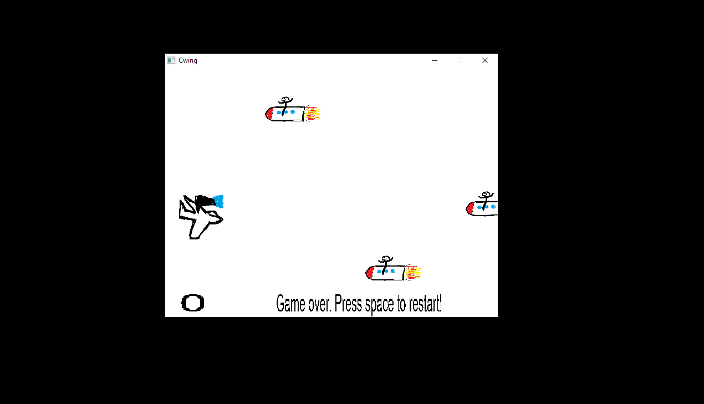

# Cpp-Spaceinvaders-like-Game
Spaceinvaders like game created in C++ for a school project. SDL2 used for graphics.  
Goal was to create a game engine from where the game easily could be expanded with new objects and to keep the game free from memory leaks. 

